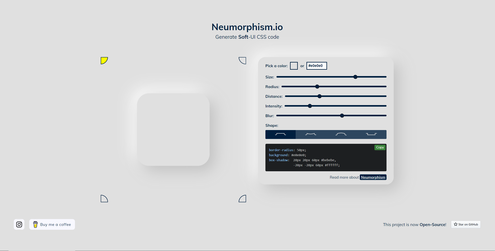
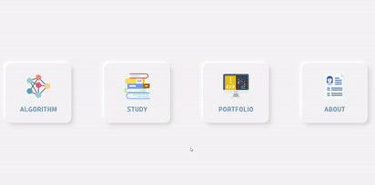
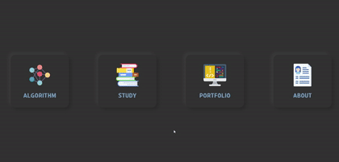

#### Neumorphism

객체와 배경간의 구분을 그림자로만 구별하여 볼륨감 있고, 뭔가 클릭하고 싶어지는 느낌을 받게하는 디자인

<br />

##### 장점

* 둥글둥글하여 부드러운 인상을 준다.
* 사용자로 하여금 클릭하고 싶어지는 느낌을 준다.
* 미래적인 느낌 (?)

<br />

##### 단점

* 가독성이 좋지는 않다. (블로그에 있어서 좋진 않다고 생각하지만, 적절히 활용한다면 괜찮을 것 같았다.)
* 화면 복잡도를 제어하기 힘들다. (하지만, 나는 미니멀리즘을 추구하는 사람...사실 복잡한 UI를 좋아하지 않는다.)
* 흰 배경을 못쓴다. (이건 좀 아쉽긴 했다ㅠ)

<br />

여튼 이러한 장단점을 가진 뉴모피즘은 사람들 간에 있어서 호불호가 갈리는 그런 디자인 같았다. 그래서 사실 내가 원하던 디자인은 뉴모피즘 말고 글래스모피즘이었다. 

<br />

글래스모피즘은 블러 효과를 준 것을 기반으로 하는 디자인인데, 이름과 같이 유리를 댄 듯한 느낌을 준다. 그래서 이 디자인을 목표로 블로그를 만드려고 했는데, 실패했다 ㅎㅎ!

<br />

실패원인은 배경이 맘에 드는 것이 별로 없었고, 색감이 들어가다 보면 디자인적 요소를 정말 잘 꾸며야한다는 생각이 들게 되었다. 그래서 나는 일단 블로그를 만드는 것이 목표였기 때문에 단순하게 뉴모피즘을 택을 하였다. 

<br />

시간이 남거나 디자인 적으로 맘에드는 배경화면이 나타나게 된다면 글래스모피즘을 다시 한 번 시도할 것이다. 어쨌든, 서론이 길었는데 뉴모피즘을 활용하여 만들었던 기록을 남기려고 한다.


<br />

<br />

##### 참고한 사이트

[Neumorphism.io](https://neumorphism.io/#e0e0e0)은 뉴모피즘을 자동으로 구현해주는 사이트이다. 이 사이트를 활용하여 블로그를 꾸미게 된다면 조금 더 편할 것이다.

<br />




<br />

##### CSS

나는 다크모드를 구현한 상태라서 뉴모피즘을 라이트, 다크 모드 두가지로 만들게 되었다. 그리고 그림자 뿐만아니라 **클릭**이라는 느낌을 주기 위해 hover된 상태도 꾸미게 되었다. 

```css
.light {
  --toggleShadow:6px 6px 8px #dadada, -6px -6px 8px #ffffff;
  --toggleHover:  inset 6px 6px 8px #dadada, inset -6px -6px 8px #ffffff;
}
```





```css
.dark {
  --toggleShadow:6px 6px 8px #2b2b2b, -6px -6px 8px #3b3b3b;
  --toggleHover:  inset 6px 6px 8px #2b2b2b, inset -6px -6px 8px #3b3b3b;
}
```





<br />

사실 아직 덜 꾸민 블로그지만, 적당히 꾸민 것 같으니 앞으로는 알고리즘 공부나 자격증 등을 공부하는 것에 시간을 더 투자해야겠다는 생각이 들었다. 주말을 이용해 블로그를 꾸며야겠다.

