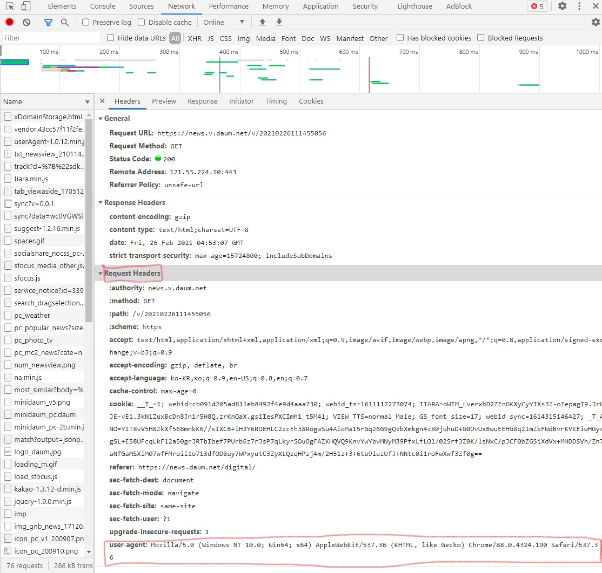

### API 사용하기

##### Request

###### 모듈

```python
import requests
```


###### get 요청

```python
url = 'https://www.naver.com/'
data = requests.get(url)
data.text
```


###### post 요청

* 민감한 데이터를 전달할 때 사용 (로그인..)

```python
url = 'https://site/login~~'
login = {
    'id':'my_id',
    'pwd':'my_pwd'
}

data = requests.post(url, data=login)
data.text
```


###### Header 데이터 이용

* 동일하게 크롤링을 했는데 크롤링이 되지 않을 때 이용
* 단순 url로만 크롤링이 안될 때... 기본적으로 user-agent가 자주 이용됨



```python
url = 'https://news.v.daum.net/v/20210226111455056'
header = {
    'user-agent': 'Mozilla/5.0 (Windows NT 10.0; Win64; x64) AppleWebKit/537.36 (KHTML, like Gecko) Chrome/88.0.4324.190 Safari/537.36'
}

data = requests.get(url, headers=header)
data.text
data.status_code  # 200
```


##### Open API 이용

* 주로 [공공데이터 포탈](https://www.data.go.kr/)에서 활용하는 편이다.
* API 활용 요청을 하면 발급해주는 key를 활용하면 된다.
* 참고문서를 보면서 api호출에 필요한 파라미터 값을 구성하면 된다.


