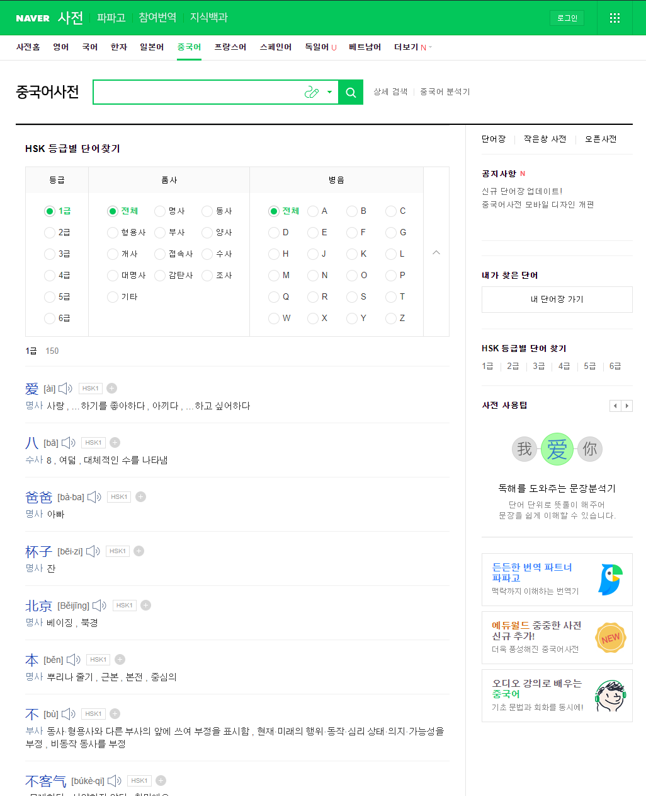
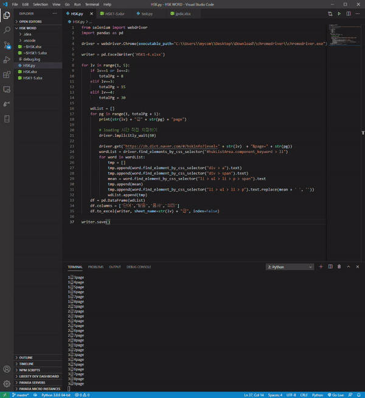
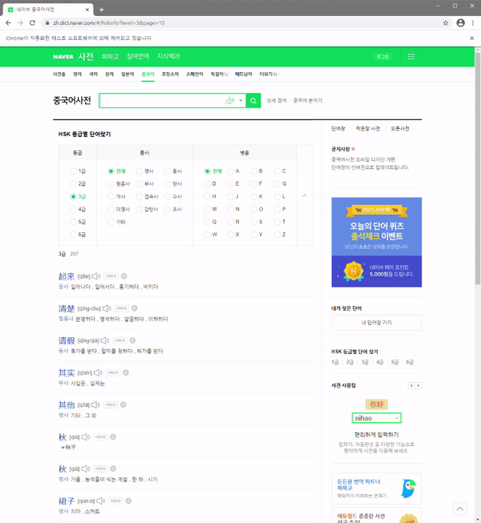

###### Side Project #1 

#### HSK 단어장 웹 스크래핑

<hr />

##### 크롤링과 스크래핑의 차이

처음에 나는 웹 사이트의 내용을 파싱해 저장하는 작업이 크롤링이라고 생각을 했었다. 하지만 이번 사이드 프로젝트를 진행하기 위해 크롤링 방법을 찾아보던 중 스크래핑이라는 단어를 알게 되었다. 사실 단어 의미 상으로는 굳이 큰 차이가 있을까 생각이 들었는데, 자세히 알아보고 나니 차이점이 있었다. 

* **크롤링** : 조직적이고 자동화된 방법으로 웹을 탐색하는 프로그램
* **스크래핑** :  HTTP를 통해 웹 사이트에 있는 정보를 원하는 형태로 가공하는 방식이다.

보통 사람들이 크롤링이라고 부르는 작업들 중에서 몇몇은 스크래핑이라는 단어가 더 맞다고 생각이 들었다. 어쨌든 나는 둘의 차이에 크게 의미를 두지 않고 그냥 내가 원하는 작업을 하기로 했다. 둘 다 해보면 되는거지 뭐!


##### Side Project

사이드 프로젝트는 진짜 내가 가볍고 단순하게 할 수 있는 것들로 진행할 것이다. 예를 들면, 필요한 단어 사전을 크롤링해서 외운다든지, 새로운 언어로 TO DO LIST를 만들어 본다든지....

음..그냥 단순하게 개발에 대한 흥미를 놓지 않기 위해 시작하게 되었다는 의미가 맞는 것 같다. 재밌잖아ㅎㅎ

<br />

그렇게 해서 시작하게 된 **중국어 단어장 웹 스크래핑** 📕

먼저, 나는 주 언어가 Python이라 Python을 통해 스크래핑을 했다. 

저번에 영화 데이터를 한 번 스크래핑 해봤는데, 그 때는 BeautifulSoup을 이용하여 스크래핑을 하였다. 이번에도 BeautifulSoup를 사용해서 하려고 했는데 컴퓨터가 이상한 것인지..코드가 작동되지 않아서 다른 방법인 Selenium을 활용하여 개발을 진행하였다.

<br />

둘의 차이는 javascript rendering기능 제공 여부가 조금 큰 것 같았지만, 둘 다 사용해본 결과 코드는 Selenium이 더 직관적이었지만, webdriver와 같은 기능이 나는 조금 불편해서 그런가 Selenium이 느리다는 생각이 많이 들었다.


어쨌든,

##### 시작

일단, Selenium을 설치하고, 

```sh
pip install selenium
```

webdriver를 다운받아야한다. 다양한 드라이버가 있는 것 같은데 나는 주로 Chrome을 사용하기 때문에 Chrome Driver를 다운 받았다.

[ChromeDriver 받기](https://chromedriver.chromium.org/downloads)

* 여기서 주의해야할 점은 Chrome 버전을 확인한 후에 받아야한다. 이걸 모르고 최신버전을 다운받았더니 되지 않았다.. 그것때문만은 아니었을 수도 있지만...

  ```sh
  # 크롬 버전 확인
  chrome://version
  ```

다운받은 드라이버는 나는 python 코드와 동일한 폴더에 넣었다. 

```sh
# 폴더 구조
HSK WORD
├ HSK.py	# 코드
└ chromedriver.exe
```

그리고 나는 dataframe을 이용해 csv 파일로 바로 저장할 계획이라 pandas와 openpyxl를 설치해 주었다.

```sh
pip install pandas openpyxl
```


이제 진짜 시작!

##### 과정

1. 먼저 webdriver를 통해 브라우저를 불러올 준비를 한다.

   ```python
   from selenium import webdriver
   
   driver = webdriver.Chrome("./chromedriver.exe")
   ```

2. 네이버 HSK 단어장을 들어가보면, HSK 단어장이 존재한다.

   


나는 1급부터 4급까지의 단어를 원했고, 사실 여기서 크롤링과 스크래핑의 차이가 있지 않나 생각이 들었다. 크롤링은 paginate를 저절로 찾고, 그 규칙을 토대로 자동적으로 페이지를 넘기는 느낌..?

<br />

하지만, 나는 단순히 기본적인 스크래핑을 공부하고 있고, 내일부터는 HSK 단어장을 통해 단어를 외워야했기에.. 그냥 전체 페이지 개수를 따로 적어주었다. ~~어짜피 4개뿐인걸?~~

```python
for lv in range(1, 5):
    if lv==1 or lv==2:
        totalPg = 8
    elif lv==3:
        totalPg = 15
    elif lv==4:
        totalPg = 30
```


3. 드라이버를 통해 주소를 GET하고 그 주소의 HTML문서의 셀렉터들을 통해 코드를 구현하였다.

   ```python
   wdList = []
   for pg in range(1, totalPg + 1):
       print(str(lv) + "급" + str(pg) + "page")		# 몇급 몇페이지인지 확인
   
       driver.get("https://zh.dict.naver.com/#/hskinfo?level=" + str(lv)  + "&page=" + str(pg))
       wordList = driver.find_elements_by_css_selector("#hskListArea.component_keyword > li")
       for word in wordList:
           tmp = []
           tmp.append(word.find_element_by_css_selector("div > a").text)	# 단어 
           tmp.append(word.find_element_by_css_selector("div > span").text)	# 발음
           mean = word.find_element_by_css_selector("li > ul > li > p > span").text	#품사
           tmp.append(mean)
           tmp.append(word.find_element_by_css_selector("li > ul > li > p").text.replace(mean + ' ', ''))  # 의미
           wdList.append(tmp)
   ```

   * 흠 생각으로는 저 get요청도 parameter를 받고 할 수 있을 것 같은데 생략생략 땅땅땅

4. 이후 데이터프레임으로 만들어 바로 csv에 저장을 하였다.

   ```python
   import pandas as pd
   
   writer = pd.ExcelWriter('HSK1-4.xlsx')
   for lv in range(1, 5):
       ...
   	# 코오오오드
       ...
       df = pd.DataFrame(wdList)
       df.columns = ['단어','발음','품사','의미']
       df.to_excel(writer, sheet_name=str(lv) + "급", index=False)
       
   writer.save()
   ```


##### 실행

<div style="text-align:center;">
	
	
</div>


##### 문제발생

스크래핑에 적합한 코드라고 생각했지만, 웹드라이버의 로딩시간이 부족하여 데이터가 제대로 저장되지 않고 페이지가 넘어가는 현상이 나타나게 되었다. 

그래서 loading시간을 직접 지정하여 그 문제를 해결하였다.

```python
# loading 시간 직접 지정하기
driver.implicitly_wait(60)
```

<br />

스크래핑을 배우기엔 생각외로 간단하고 정말 사이드 프로젝트라는 이름에 걸맞는 공부였다. ㅎㅎㅎㅎ

다음 사이드는 뭘로하지??