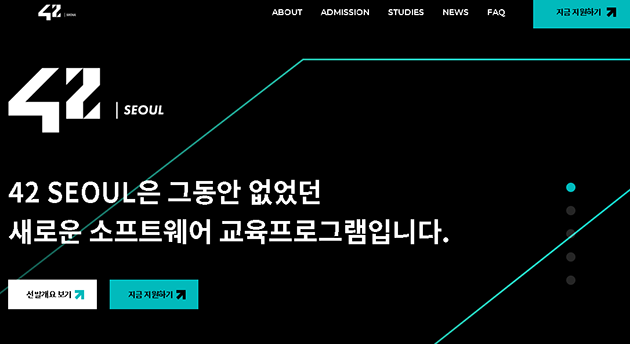
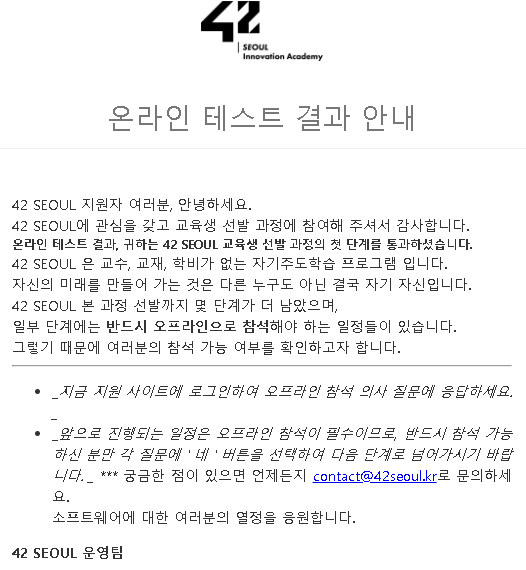
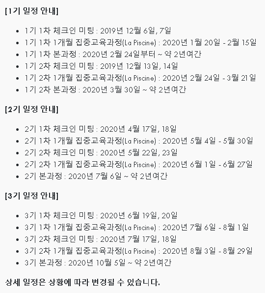

## 42SEOUL  

#### 지원 요강

**지원대상** : 2020년 1월 1일 기준 민법상 성인 또는 2020년 3월 1일 기준 고졸 이상의 학력자  
**모집기간** : 2019.11.01. ~ 11.30.  
**접수방법** : [온라인 접수](www.innovationacademy.kr)  
**교육기간** : 2년간

#### 선발 프로세스  

* **온라인 신청 및 테스트** : 기억력 테스트 + 논리력 테스트  
* **체크인** : 온라인 테스트 합격자에 한하여 본인 확인 및 신청 조건 해당 여부 확인  
* **1개월 집중교육** : 1개월 오프라인 과정으로 그 후에 에꼴24 본 과정에 돌입  

#### 1. 지원   

[42seoul](www.innovationacademy.kr)에서 지원하면 된다. 자기소개서도 없었고, 단순히 일단 지원하는 것이었다.  
그래서 오늘 지원을 하고 바로 온라인 테스트를 치게 되었다.  

   

#### 2. 온라인 테스트   

이것도 테스트가 2개가 있었다.  
**TEST1**은 4분 동안 기억력 테스트로 진행하는 것이고,  
**TEST2**은 2시간 동안 논리력 테스트를 진행하는 것이다.  

TEST1은 진짜 얼마 못했던 것 같다. 그냥 시작했는데, 생각외로 너무 간단한 테스트이면서도 당황스러웠다. 그래도 나름 괜찮게 풀어서 일단 넘어갔다.  

그런데 문제는 TEST2!!!  
처음에는 문제 오류 뜬 줄 알고 몇 번이나 껐다 켰다...  
그리고 한 25분 지나서야 규칙을 깨닫고 1단계를 넘겼다.
유튜브나 블로그 후기들을 보고 시험을 치는 것을 추천한다.
어쨌든 그래도 적응을 하고 난 뒤에는 나름 5~10분 사이에 레벨을 올릴 수 있었다. 그렇게 13단계까지 했나..  

#### 3. 온라인 테스트 결과 

결과는 48시간 이내에 이메일로 온다고 하길래 기다렸더니, 오늘 바로 합격 메일이 왔다.  

### **합격!!!!**  

사실 요즘 합격이라는 단어가 너무 듣고 싶어서 자격증을 하나 더 공부해볼까 생각도 했다. 자존감이 많이 떨어진 것 같은 요즘ㅠ  
나에게 내려진 단비 같은 **합격**이라는 글자

감사합니다.감솨합니다.  

알고보니 TEST1과 TEST2에서 Lv.10이상까지 가면 대부분 합격인 것 같았다. 나도 15레벨과 13레벨까지 간 것 같다. 좀 더 일찍 알았으면 1기에 할 수 있었을텐데 아쉽다.  

그렇게 하고 나서 이제 체크인 날짜를 정해야 한다.  너무 많은 지원자가 일찍 지원해서 1기는 기회가 없었고ㅠ  
2기,3기 중에 고민해야 했다.  

그렇게 체크인 등록까지 마치고, 이제 기다리는 일만 남았다.ㅎㅎ