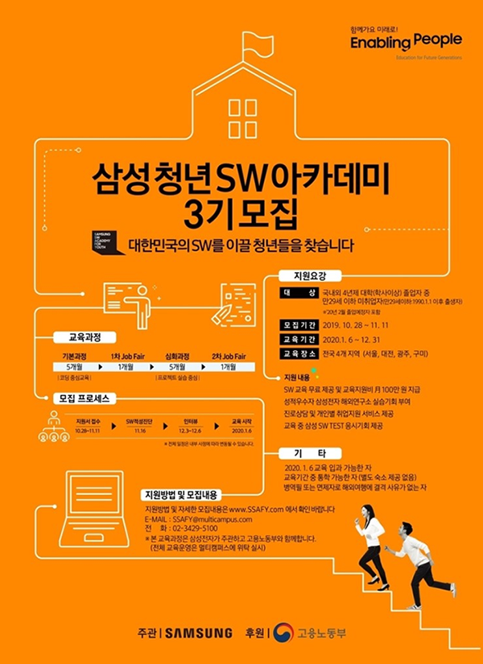

#### 4. SW적성진단 결과  

**11월 16일 12시**에 SW적성진단을 쳤다.  

1과목인 수리/추리 논리는 진짜 정말 잘 친 것 같아서 걱정이 없었는데, 문제는 2과목의 컴퓨팅사고력 문제였다.

정말 많이 걱정했는데, 다행히도 커트라인 안에는 들었던 것 같다.  

### **합격!!!!**  

블로그의 후기를 보면, 과목당 70% 정도는 맞아야 하는 것 같다는 얘기도 있어서 사실 큰 기대는 하지 않았다.  
그리고 그저께 꿈에 불합격이라는 꿈을 꿨다.ㅠㅠ
못 푼 문제가 많아서 그럴 것이라고 예상은 했지만, 막상 꿈에서 불합격이라고 하니까 우울했었는데...  
다행히도 오늘 합격이라는 결과를 받게 되었다.  

감사합니다ㅠㅠㅠ

1과목의 영향이 크지 않았나..하는 생각이 든다.  

#### 5. 온라인 사전학습  

바로 면접에 들어갈 줄 알았는데, 온라인으로 사전학습을 들어야 했습니다.

E-mail 로 받은 내용은

**IT트렌드, 창의/열정, SW기초 등 관련 분야의 지식을 얻을 수 있는 유익한 시간**  

이라는 말이었다.  

일단 듣고 면접을 준비해야겠다는 마인드로 열심히 아이패드에 필기도 했다..ㅎㅎ
