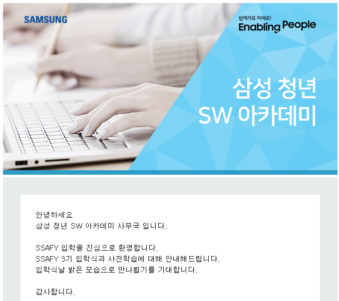

#### 7. 합격  

우와아아 **12월 17일 오후 2시 12분**에 합격발표가 났다. 홈페이지에서 입과 여부를 최종적으로 확정하고, 입학식 때 필요한 입학정보를 등록해야 했다.  

일주일 전에 난 결과지만, 입학정보 사진도 찾고 집도 찾아본다고 정신없는 일주일이 지나갔다.  

* **집 구하기**  

합격발표가 나자마자 금요일에 바로 대전에 집을 구하러 올라갔다. 한밭대 주변과 충남대 궁동 주변에서 구할 수 있다고 하는데, 날짜가 애매해서 매물이 많이 없었다.  

그래서 여러 곳을 직접 발품 팔아서 구경도 하고 했는데, 맘에 드는 곳도 별로 없고 1월 4일 자에 입실할 수 있는 곳이 많이 없었다. 

결국 부동산을 통해서 집을 구했다.ㅜㅜ

#### 8. 사전학습  

오늘 SSAFY에서 메일이 왔다. 대전 셔틀버스 노선 안내도와 약도, 입학식장 위치 등을 담은 메일이다.  

입학식 및 오리엔테이션...1월 6일 오전 8시 반까지 도착이라늬...  
셔틀버스가 몇 개 있었던 것 같은데, 1개로 줄어든 건지 사진에는 하나뿐이었다.  
그리고 사전학습을 듣고 와야 하는데, 뭔가 기대되면서도 걱정 반 기대 반..

빨리 6일이 왔으면 좋겠다는 생각도 들지만, 직장인과 같이 오전 9시부터 오후 6시까지 일..?코딩을 하면서 지내야 한다고 생각하니까 걱정도 되기 시작했다.  
그래도 하면서 규칙적인 습관도 만들고, 열심히 친구들과 같이 프로젝트도 해보는 경험을 할 수 있다는 것에 대한 기대감이 더 크다.
