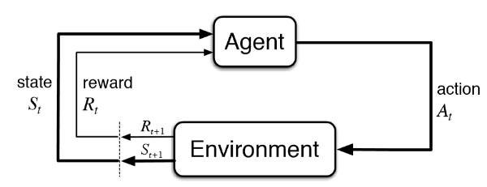

### Machine Learning

##### 개념

* x를 가지고 y를 예측하고 싶을 때
* 인공지능의 한 분야로 컴퓨터가 학습할 수 있도록 하는 알고리즘과 기술을 개발하는 분야
* 특징
  * x를 가지고 y를 찾는 함수 f를 만드는 것
  * x만을 가지고 x의 특징을 찾아내는 함수 f를 만드는 것

```sh
    Y 	 = 	  f			(X)
출력 변수	알고리즘	입력 변수
```


<br />

##### 종류

###### 지도학습(Supervised Learning)

* 회귀(Regression) : X에 대해 실수 값을 가진 연속형 출력변수인 Y를 예측할 때
  * 예 : 키, 몸무게, 주식 가격 ...
* 분류(Classification): X에 대해 이산형 출력 변수 Y를 예측할 때
  * 예 : 성별, 비만 여부,  불량 여부 ...


###### 비지도학습(UnSupervised Learning)

* Y가 존재하지 않고, 입력 변수 X간의 관계에 대해 모델링
* 보통 Y가 존재하는 것이 많지 않기 때문에 비지도 학습이 좀 더 중요할 수도..
* 군집 분석 : 유사한 데이터끼리 그룹화
* PCA


###### 강화학습(Reinforcement Learning)

* 시뮬레이션을 통해 현재의 선택이 먼 미래에 보상이 최대가 되게 학습시키는 것
* Agent가 action취하고 보상을 받으면 이 보상이 최대가 되게 최적의 action 취하는 법을 배움
* 예 : 알파고




##### 모델

* 간단하게 개념만 알아두고, 다시 하나하나 공부할 예정!

###### 선형 회귀 분석(Linear Regression)

* 독립변수와 종속변수가 선형적인 관계라는 가정하에 분석
* 장점
  * 독립변수 중요도와 영향력 파악이 쉬움
* 단점
  * 선형이 아닌 관계에 대해서 분석이 힘듬


###### 의사 결정 나무(Decision Tree)

* 독립변수 조건에 따라 종속변수 분리
* 장점
  * 이해가 쉬움
* 단점
  * overfitting(과적합)이 잘 일어남 : 오늘 한 건 잘 맞는데, 미래의 것이 잘 맞지 않을 수 있는 것
  * 주로 간단한 문제에만 사용


###### KNN(K-Nearest Neighbor)

* 새로 들어온 주변 K개의 데이터의 class로 분류하는 기법


##### Neural Network

* 딥러닝의 기초
* 입력, 은닉, 출력 층으로 구성된 모형으로 각 층을 연결하는 노드의 가중치를 업데이트하면서 학습


###### SVM(Support Vector Machine)

* class 간의 거리가 최대가 되게 decision boundary 만드는 방법
* 요즘엔 잘 쓰이지 않음
* 학습시간이 오래 걸림


###### 앙상블(Ensemble Learning)

* 여러개의 모델을 결합해 사용
* Classifier or Base Learner


###### K-means clustering

* Label 없이 데이터 군집으로 K개로 생성
* 비지도학습
* 데이터가 너무 고차원으로 가면 되기 힘듬