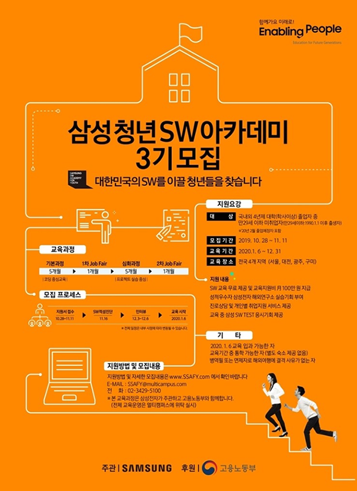

#### 6. Interview  

**2019년 12월 4일** 대전에서 면접을 보게 되었다.  
가서 보안서약서를 작성했기 때문에 자세한 것은 말할 수 없지만, 기록하면 내가 면접장에서 느낀 것들을 기억해낼 수 있을 것 같아서 적게 되었다.  

지방에서 올라가야 해서 기차를 타고 전날에 가서 하루를 자고 면접을 보러 가게 되었는데, 전날에 잠도 안 오고 뒤척이다가 늦게 잠들었다.   

그래도 다행히 늦지 않게 면접장에 도착했고, 정장을 입으신 분들이 반?반보다 조금 더?(약 3/5?????) 계셨던 것 같다. 나는 그냥 비즈니스 캐쥬얼로 입고 가긴 했는데, 진짜 복장은 그냥 단정하게만 입고 가면 되는 것 같아서 다음부터는 복장에 신경 쓰기보다는 면접을 좀 더 열심히 준비해야겠다고 생각했다.  

그리고 면접 때 준비해야 할 서류는 메일 받자마자 뽑아두시길..
어떻게 될지 모르는 거니까 미리미리 준비합시다!(●'◡'●)

음, 근데 막상 가서 면접을 볼 때는 긴장이 많이 안 돼서 다행이었고, 그럭저럭 열심히 말을 열심히 했던 것 같다.  
사실 면접에 관해서 얘기할 수 있는 게 한정적이라 딱히 말할 건 없는데, 일단 4기 도전기를 다시 찍을 수도 있으니까 느낌만 적자면..!!!   

**CT**는 사실 공부라고 하기엔 IQ테스트 느낌이니까 그냥 평소 실력대로 하고,  
**면접**은 평소 기업 면접을 준비하듯이 열심히 하고 말을 잘 정리해서 가면, 기업면접보다 분위기가 조금은 더 편한 곳에서 인터뷰처럼 할 수 있을 것 같다.  

그리고 면접이 끝나고, 같이 면접 보신 분들과 함께 근처에 대전의 명물(?) 성심당 본점에 들려서 빵도 사고.. 청년다방에서 떡볶이도 먹고ㅎㅎ

약 10일에서 14일 뒤에 면접결과가 나올 것이라고 **예상**하고 있는데, 빨리 결과가 나왔으면 좋겠다..
